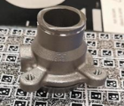

# NERFBK: A HIGH-QUALITY BENCHMARK FOR NERF-BASED 3D RECONSTRUCTION
Our high-quality dataset evaluates NeRF-based methods for 3D metrology. Researchers can compare methods on textured, textureless, metallic, transparent, and aerial objects to optimize and validate techniques for real-world use, such as in industrial inspections and cultural heritage preservation.

[**[Paper]**]() [**[Download]**](#Download) 
---

##  Datasets

  <table   style=”margin: auto；” width=’60%’>
  <thead>
    <tr>
      <th  width="10%"></th>
      <th colspan="2",  width="30%">Dataset</th>
      <th  width="10%">Images</th>
      <th  width="10%">Camera Type</th>
      <th  width="10%">approx size(cm)</th>
      <th  width="20%">Description</th>
      <th  width="10%">Ground True</th>
    </tr>
  </thead>
  <tbody>
    <tr>
      <td rowspan="4",  align="center" ><strong>Industrial</td>
      <td align="center", width="10%">Industrial_A</td>
      <td align="center", width="40%"></td>
      <td align="center", width="10%">295</td>
      <td align="center"，width="10%">Huawei p30 (resolution: 1080x1920)</td>
      <td align="center"，width="10%">5x5x4</td>
      <td align="center"，width="10%">Textureless Small and complex Reflective Two acquisitions Ground truth Video</td>
      <td align="center"，width="10%">Hexagon active scanner</td> 
    </tr>
    <tr>
      <td align="center">Industrial_B</td>
      <td align="center"> </td>
      <td align="center">271</td>
      <td align="center">Huawei p30 (resolution: 1080x1920)</td>
      <td align="center">15x12x4</td>
      <td align="center">Textureless complex Reflective Ground truth Video</td>
      <td align="center">Hexagon active scanner</td> 
    </tr>
    <tr>
      <td align="center">Industrial_C</td>
      <td align="center"> </td>
      <td align="center">213</td>
      <td align="center">Huawei p30 (resolution: 1080x1920)</td>
      <td align="center">7x7x14</td>
      <td align="center">Textureless complex Reflective Ground truth Video</td>
      <td align="center">Hexagon active scanner</td> 
    </tr>
    <tr>
      <td align="center">Synthetic</td>
      <td align="center"> </td>
      <td align="center">373</td>
      <td align="center">Virtual pinhole camera (resolution: 1920x1080)</td>
      <td align="center">11x11x2</td>
      <td align="center">Well-textured complex Ground truth Video</td>
      <td align="center">Blender</td> 
    </tr>
    <tr>
      <td rowspan="4" align="center"><strong>Transparent</td>
      <td align="center">Glass_A</td>
      <td align="center"> </td>
      <td align="center">552</td>
      <td align="center">Huawei p30 (resolution: 1080x1920)</td>
      <td align="center">5x5x25</td>
      <td align="center">Complex shape Highly refractive Ground truth Video</td>
      <td align="center">Photogrammetric</td> 
    </tr>
    <tr>
      <td align="center">Glass_B</td>
      <td align="center"> </td>
      <td align="center">383</td>
      <td align="center">Huawei p30 (resolution: 1080x1920)</td>
      <td align="center">6x6x10</td>
      <td align="center">Complex shape Highly refractive Ground truth Video</td>
      <td align="center">Photogrammetric</td> 
    </tr>
    <tr>
      <td align="center">Cup</td>
      <td align="center"> </td>
      <td align="center">300</td>
      <td align="center">Huawei p30 (resolution: 1080x1920)</td>
      <td align="center">8x8x10</td>
      <td align="center">Complex shape Highly refractive Ground truth Video</td>
      <td align="center">Photogrammetric</td> 
    </tr>
    <tr>
      <td align="center">Transbottle</td>
      <td align="center"> </td>
      <td align="center">300</td>
      <td align="center">Huawei p30 (resolution: 1080x1920)</td>
      <td align="center">6x6x30</td>
      <td align="center">Complex shape Highly refractive Ground truth Video</td>
      <td align="center">Photogrammetric</td> 
    </tr>
    <tr>
      <td rowspan="4" align="center"><strong>Heritage</td>
      <td align="center">Doss Trento</td>
      <td align="center"> </td>
      <td align="center">761</td>
      <td align="center">high resolution: 1080x1920,  low resolution: 540x690</td>
      <td align="center"></td>
      <td align="center">Outdoor large scale Dense images Ground truth</td>
      <td align="center">Laser Scanner</td>
    </tr>
    <tr>
      <td align="center">Cyprus</td>
      <td align="center"> </td>
      <td align="center">176</td>
      <td align="center">Samsung S6
+ NIKON (resolution: 3840x2160)</td>
      <td align="center"></td>
      <td align="center">Outdoor large scale Sparse images Ground truth</td>
      <td align="center">Photogrammetric</td>
    </tr>
    <tr>
      <td align="center">Statue</td>
      <td align="center"> </td>
      <td align="center">100</td>
      <td align="center">NIKON D750 (resolution: 6016x4016)</td>
      <td align="center"></td>
      <td align="center">Outdoor large scale Two cameras Sparse images Ground truth</td>
      <td align="center">Blender</td>
    </tr>
    <tr>
      <td align="center">Baalshamin</td>
      <td align="center"> </td>
      <td align="center">47</td>
      <td align="center">Multisensor (resolution: 600x399  to  4288x2848)</td>
      <td align="center">500x1500</td>
      <td align="center">Multisensor Lost object Suboptimal baseline Unconstrained dataset</td>
      <td align="center"></td>
    </tr>
    <tr>
      <td align="center"><strong>Aerial</td>
      <td align="center">Dortmund</td>
      <td align="center"> </td>
      <td align="center">59</td>
      <td align="center">Multi-sensor (resolution: 8176x6132  and  6132x8176)</td>
      <td align="center">City scale</td>
      <td align="center">Outdoor large scale Five sensors Sparse images Ground truth</td>
      <td align="center"></td>
    </tr>
  </tbody>
  </table>

---
##  Download

Datasets will be downloadable soon. 

NeRFBK was created by the [3D Optical Metrology unit (3DOM)](https://3dom.fbk.eu/) of Fondazione Bruno Kessler (FBK).
## Citation

Please consider citing our work:

    @inproceedings{
    }

---
##  Changelog 
* [2023-06-10] Uploaded newest version.

