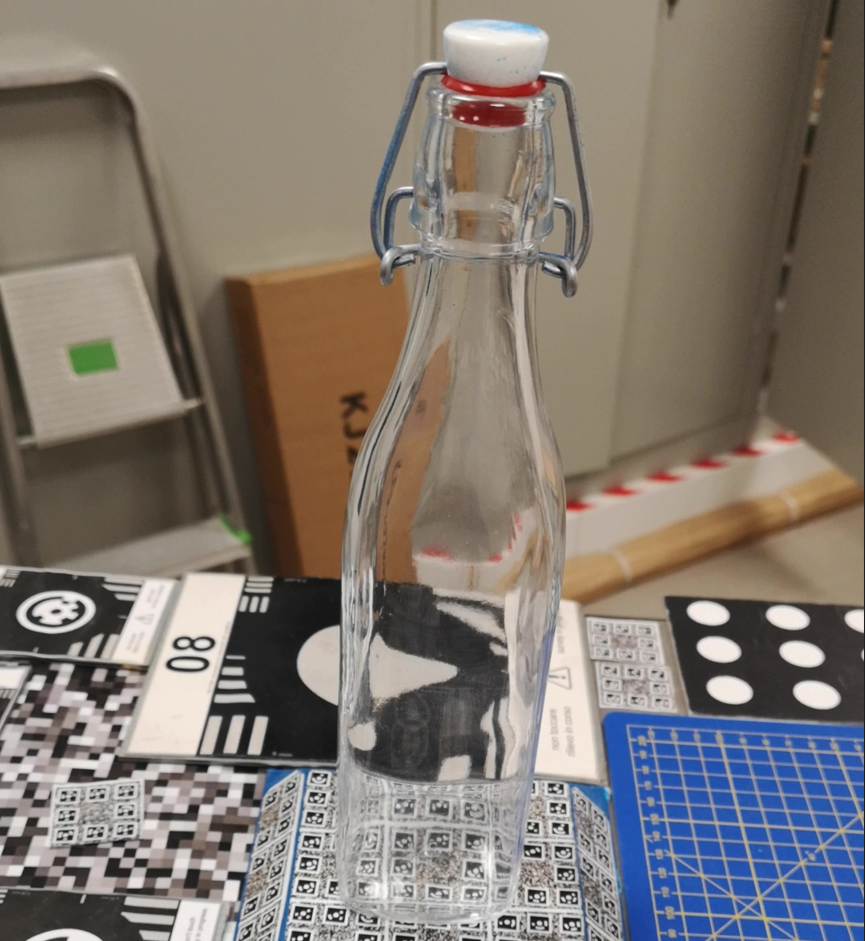
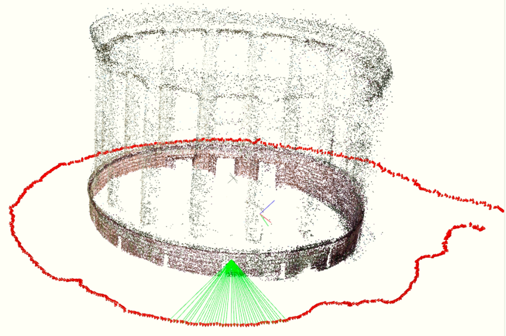
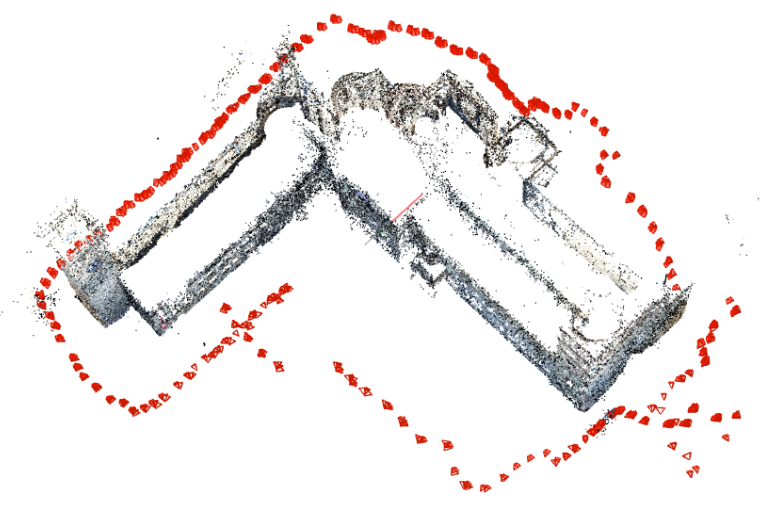

# NERFBK: A HOLISTIC DATASET FOR BENCHMARKING NERF-BASED 3D RECONSTRUCTION
This is a repository of image collections - called NeRFBK - with real and synthetic data specifically assembled to support researchers in evaluating and comparing the performances of NeRF algorithms against a reliable and accurate Ground Truth (GT). 
The data contains industrial objects (reflective and textureless metallic surfaces), transparent objects (mainly glasses), heritage scenarios (including lost scenes), as well as large-scale urban areas acquired with drone or airborne cameras. 
Researchers can compare NeRF methods on textured, textureless, metallic, transparent and aerial scenes to optimize and validate techniques for real-world use, such as in industrial inspections, cultural heritage preservation or large-scale 3D modeling.
For each dataset, GT data vary from LiDAR or Terrestrial Laser scanning to high-resolution photogrammetry. Using these GT, quantitative evaluations can be performed to provide an unbiased comparison of geometric accuracy. Different approaches and metrics can include best plane fitting, cloud-to-cloud comparison, profiling, accuracy and completeness analyses, RMSE, etc. 
For each scenario, images and GT data can be downloaded from the given links.

If you use these data and you publish any result, please acknolwedge this repository and its related publications. Thanks!

[**Related Papers**]
- Gabriele Mazzacca, Ali Karami, Simone Rigon, Elisa Mariarosaria Farella, Pawel Trybala and Fabio Remondino, 2023: <a href="https://isprs-archives.copernicus.org/articles/XLVIII-M-2-2023/1051/2023/" target=page>NeRF FOR HERITAGE 3D RECONSTRUCTION</a>. Int. Arch. Photogramm. Remote Sens. Spatial Inf. Sci., XLVIII-M-2-2023, pp. 1051–1058
- Fabio Remondino, Ali Karami, Ziyang Yan, Gabriele Mazzacca, Simone Rigon and Rongjun Qin, 2023: <a href="https://www.mdpi.com/2072-4292/15/14/3585" target=page>A CRITICAL ANALYSIS OF NERF-BASED 3D RECONSTRUCTION</a>. Remote Sensing, Vol. 15(14), 3585
- Ziyang Yan, Gabriele Mazzacca, Simone Rigon, Elisa Mariarosaria Farella, Pawel Trybala, Fabio Remondino, 2023: NERFBK: A HOLISTIC DATASET FOR BENCHMARKING NERF-BASED 3D RECONSTRUCTION. Int. Arch. Photogramm. Remote Sens. Spatial Inf. Sci., forthcoming / in preparation

##  Datasets - Downloading coming soon!

  <table   style=”margin: auto;” width=’40%’>
  <thead>
    <tr>
      <th  width="10%"></th>
      <th  width="40%">Dataset</th>
      <th  width="10%">Numb. images</th>
      <th  width="20%">Camera type & image size</th>
      <th  width="10%">Approx. size(cm)</th>
      <th  width="20%">Description</th>
      <th  width="10%">Ground Truth (GT)</th>
    </tr>
  </thead>
  <tbody> 
    <tr>
      <td rowspan="15",  align="center" ><strong>Industrial</td>
      <td colspan="1",  align="center">Industrial_A</td>
      <td rowspan="3",  align="center">295</td>
      <td rowspan="3",  align="center">Huawei p20 pro,  1080x1920 px</td>
      <td rowspan="3",  align="center">5x5x4</td>
      <td rowspan="3",  align="center">Textureless,  Small and Complex,  Reflective,  Two acquisitions,  Video</td>
      <td rowspan="3",  align="center">Triangulation scanner</td>
    </tr>
    <tr>
      <td align="center"></td>
    </tr>
    <tr>
      <td align="center"></td>
    </tr>  
    <tr>
      <td colspan="1",  align="center">Industrial_B</td>
      <td rowspan="3",  align="center">220</td>
      <td rowspan="3",  align="center">Huawei p20 pro,  1080x1920 px</td>
      <td rowspan="3",  align="center">15x12x4</td>
      <td rowspan="3",  align="center">Textureless,  Complex,  Reflective,  Video</td>
      <td rowspan="3",  align="center">Triangulation scanner</td>
    </tr>
    <tr>
      <td align="center"> </td>
    </tr>
    <tr>
      <td align="center"> </td>
    </tr>
    <tr>
      <td colspan="1",  align="center">Industrial_C</td>
      <td rowspan="3",  align="center">213</td>
      <td rowspan="3",  align="center">Huawei p20pro,  1080x1920 px</td>
      <td rowspan="3",  align="center">7x7x14</td>
      <td rowspan="3",  align="center">Textureless,  Complex,  Reflective,  Video</td>
      <td rowspan="3",  align="center">Triangulation scanner</td>
    </tr>
    <tr>
      <td align="center"> </td>
    </tr>
    <tr>
      <td align="center"> </td>
    </tr>
    <tr>
      <td colspan="1",  align="center">Synthetic</td>
      <td rowspan="3",  align="center">373</td>
      <td rowspan="3",  align="center">Virtual pinhole camera,  1920x1080 px</td>
      <td rowspan="3",  align="center">11x11x2</td>
      <td rowspan="3",  align="center">Well-textured,  Complex,  Video</td>
      <td rowspan="3",  align="center">Synthetic data</td>
    </tr>
    <tr>
      <td align="center"> </td>
    </tr>
    <tr>
        <td align="center"> </td>
    </tr>
    <tr>
      <td colspan="1",  align="center">Synthetic_Metallic</td>
      <td rowspan="3",  align="center">300</td>
      <td rowspan="3",  align="center">Virtual pinhole camera,  1920x1080 px</td>
      <td rowspan="3",  align="center">16x16x13</td>
      <td rowspan="3",  align="center">Textureless,  Complex,  Reflective,  Video</td>
      <td rowspan="3",  align="center">Synthetic data</td>
    </tr>
    <tr>
      <td align="center"></td>
    </tr>
    <tr>
        <td align="center"></td>
    </tr>
    <tr>
      <td rowspan="15",  align="center"><strong>Transparent</td>
      <td colspan="1",  align="center">Glass_A</td>
      <td rowspan="3",  align="center">552</td>
      <td rowspan="3",  align="center">Huawei p20pro,  1080x1920 px</td>
      <td rowspan="3",  align="center">5x5x25</td>
      <td rowspan="3",  align="center">Complex shape,  Highly refractive,  Video</td>
      <td rowspan="3",  align="center">Photogrammetry</td>
    </tr>
    <tr>
      <td align="center"> </td>
    </tr>
    <tr>
      <td align="center"> </td>
    </tr>
    <tr>
      <td colspan="1",  align="center">Glass_B</td>
      <td rowspan="3",  align="center">377</td>
      <td rowspan="3",  align="center">Huawei p20pro,  1080x1920 px</td>
      <td rowspan="3",  align="center">6x6x10</td>
      <td rowspan="3",  align="center">Complex shape,  Highly refractive,  Video</td>
      <td rowspan="3",  align="center">Photogrammetry</td>
    </tr>
    <tr>
      <td align="center"> </td>
    </tr>
    <tr>
      <td align="center"> </td>
    </tr>
    <tr>
      <td colspan="1",  align="center">Cup</td>
      <td rowspan="3",  align="center">338</td>
      <td rowspan="3",  align="center">Huawei p20pro,  1080x1920 px</td>
      <td rowspan="3",  align="center">8x8x10</td>
      <td rowspan="3",  align="center">Complex shape,  Highly refractive,  Video</td>
      <td rowspan="3",  align="center">Photogrammetry</td>
    </tr>
    <tr>
      <td align="center"> </td>
    </tr>
    <tr>
      <td align="center"> </td>
    </tr>
    <tr>
      <td colspan="1",  align="center">Transbottle</td>
      <td rowspan="3",  align="center">300</td>
      <td rowspan="3",  align="center">Huawei p20 pro,  1080x1920 px</td>
      <td rowspan="3",  align="center">6x6x30</td>
      <td rowspan="3",  align="center">Complex shape,  Highly refractive,  Video</td>
      <td rowspan="3",  align="center">Photogrammetry</td>
    </tr>
    <tr>
      <td align="center"> </td>
    </tr>
    <tr>
      <td align="center"> </td>
    </tr>
    <tr>
      <td colspan="1",  align="center">Synthetic_Glass</td>
      <td rowspan="3",  align="center">300</td>
      <td rowspan="3",  align="center">Virtual pinhole camera,  1920x1080 px</td>
      <td rowspan="3",  align="center">10x10x22</td>
      <td rowspan="3",  align="center">Complex shape,  Highly refractive,  Video</td>
      <td rowspan="3",  align="center">Synthetic data</td>
    </tr>
    <tr>
      <td align="center"> </td>
    </tr>
    <tr>
      <td align="center"> </td>
    </tr>
    <tr>
      <td rowspan="30",  align="center"><strong>Heritage</td>
      <td colspan="1",  align="center">Doss Trento</td>
      <td rowspan="3",  align="center">761</td>
      <td rowspan="3",  align="center">Huawei p20pro,  1080x1920 px  and  540x690 px</td>
      <td rowspan="3",  align="center">2500x2500  x1500</td>
      <td rowspan="3",  align="center">Outdoor large scale</td>
      <td rowspan="3",  align="center">Terrestrial Laser Scanner</td>
    </tr>
    <tr>
      <td align="center"> </td>
    </tr>
    <tr>
      <td align="center"> </td>
    </tr>
    <tr>
      <td colspan="1",  align="center">Cyprus</td>
      <td rowspan="3",  align="center">176</td>
      <td rowspan="3",  align="center">Samsung S6,  3840x2160 px</td>
      <td rowspan="3",  align="center">1000x1000  x500</td>
      <td rowspan="3",  align="center">Outdoor large scale</td>
      <td rowspan="3",  align="center">Photogrammetry with Reflex camera</td>
    </tr>
    <tr>
      <td align="center"> </td>
    </tr>
    <tr>
      <td align="center"> </td>
    </tr>
    <tr>
      <td colspan="1",  align="center">Statue</td>
      <td rowspan="3",  align="center">100</td>
      <td rowspan="3",  align="center">Reflex camera,  6016x4016 px</td>
      <td rowspan="3",  align="center">200x100  x500</td>
      <td rowspan="3",  align="center">Outdoor large scale,  Two cameras</td>
      <td rowspan="3",  align="center">Synthetic data</td>
    </tr>
    <tr>
      <td align="center"> </td>
    </tr>
    <tr>
      <td align="center"> </td>
    </tr>
    <tr>
      <td colspan="1",  align="center">Vase</td>
      <td rowspan="3",  align="center">50</td>
      <td rowspan="3",  align="center">Google Pixel2,  4024x3016 px</td>
      <td rowspan="3",  align="center">30x30</td>
      <td rowspan="3",  align="center">Indoor</td>
      <td rowspan="3",  align="center">Terrestrial Laser Scanner,   Photogrammetry with Reflex camera</td>
    </tr>
    <tr>
      <td align="center"> </td>
    </tr>
    <tr>
      <td align="center"> </td>
    </tr>
    <tr>
      <td colspan="1",  align="center">Metopa</td>
      <td rowspan="3",  align="center">106</td>
      <td rowspan="3",  align="center">Nikon COOLPIX P90,  4000x3000 px</td>
      <td rowspan="3",  align="center">100x80x10</td>
      <td rowspan="3",  align="center">Indoor museal detailed relief</td>
      <td rowspan="3",  align="center">Terrestrial Laser Scanner</td>
    </tr>
    <tr>
      <td align="center"> </td>
    </tr>
    <tr>
      <td align="center"> </td>
    </tr>
    <tr>
      <td colspan="1",  align="center">Tunnel</td>
      <td rowspan="3",  align="center">4353</td>
      <td rowspan="3",  align="center">RealSense D455,  640x480 px</td>
      <td rowspan="3",  align="center">8000x300  x200</td>
      <td rowspan="3",  align="center">Underground,  Mobile robot based,   High framerate</td>
      <td rowspan="3",  align="center">Terrestrial Laser Scanner</td>
    </tr>
    <tr>
      <td align="center"> </td>
    </tr>
    <tr>
      <td align="center"> </td>
    </tr>
    <tr>
      <td colspan="1",  align="center">Neptune</td>
      <td rowspan="3",  align="center">680  +  214</td>
      <td rowspan="3",  align="center">Nikon D3X,  6048x4032 px,  Canon EOS 550D,   5184x3456 px</td>
      <td rowspan="3",  align="center">2500x1500  x7000</td>
      <td rowspan="3",  align="center">Outdoor large scale,  Terrestrial  +  UAV images</td>
      <td rowspan="3",  align="center">Terrestrial Laser Scanner</td>
    </tr>
    <tr>
      <td align="center"> </td>
    </tr>
    <tr>
      <td align="center"> </td>
    </tr>
    <tr>
      <td colspan="1",  align="center">Duomo</td>
      <td rowspan="3",  align="center">565</td>
      <td rowspan="3",  align="center">Samsung S6,  5312x2988 px</td>
      <td rowspan="3",  align="center">8000x8000</td>
      <td rowspan="3",  align="center">Outdoor large scale,  Terrestrial</td>
      <td rowspan="3",  align="center"></td>
    </tr>
    <tr>
      <td align="center"> </td>
    </tr>
    <tr>
      <td align="center"> </td>
    </tr>
    <tr>
      <td colspan="1",  align="center">Modena</td>
      <td rowspan="3",  align="center">134  +  87</td>
      <td rowspan="3",  align="center">Nikon D3X,  6048x4032 px</td>
      <td rowspan="3",  align="center">2500x2500</td>
      <td rowspan="3",  align="center">Terrestrial  +  UAV images</td>
      <td rowspan="3",  align="center">Terrestrial Laser Scanner</td>
    </tr>
    <tr>
      <td align="center"> </td>
    </tr>
    <tr>
      <td align="center"> </td>
    </tr>
    <tr>
      <td colspan="1",  align="center">Baalshamin</td>
      <td rowspan="3",  align="center">47</td>
      <td rowspan="3",  align="center">Multiple cameras,  From 600x399 px to 4288x2848 px</td>
      <td rowspan="3",  align="center">500x1500</td>
      <td rowspan="3",  align="center">Lost object,  Sub-optimal baselines,  Unordered touristic images,  Multiple resolutions</td>
      <td rowspan="3",  align="center"></td>
    </tr>
    <tr>
      <td align="center"> </td>
    </tr>
    <tr>
      <td align="center"> </td>
    </tr>
    <tr>
      <td rowspan="6",  align="center"><strong>Aerial</td>
      <td colspan="1",  align="center">Drone</td>
      <td rowspan="3",  align="center">224</td>
      <td rowspan="3",  align="center">Sony,  7952x5304 px</td>
      <td rowspan="3",  align="center">City scale</td>
      <td rowspan="3",  align="center">Outdoor large scale,  Built-up and vegetated areas</td>
      <td rowspan="3",  align="center">Airborne Laser Scanner</td>
    <tr>
      <td align="center"> </td>
    </tr>
     <tr>
      <td align="center"> </td>
     </tr>
    <tr>
      <td colspan="1",  align="center">Aerial</td>
      <td rowspan="3",  align="center">59</td>
      <td rowspan="3",  align="center">Multi-sensor,  6132x8176 px (N) 8176x6132 px (O)</td>
      <td rowspan="3",  align="center">City scale</td>
      <td rowspan="3",  align="center">Outdoor large scale,  Built-up and vegetated areas</td>
      <td rowspan="3",  align="center">Airborne Laser Scanner</td>
    <tr>
      <td align="center"> </td>
    </tr>
     <tr>
      <td align="center"> </td>
     </tr>
    </tr>
  </tbody>
  </table>

---

NeRFBK was created by the [3D Optical Metrology unit (3DOM)](https://3dom.fbk.eu/) of Fondazione Bruno Kessler (FBK).

The Statue set of images is part of the ENRICH dataset, available here: https://github.com/davidemarelli/ENRICH
ENRICH: multi-purposE dataset for beNchmaRking In Computer vision and pHotogrammetry
Davide Marelli, Luca Morelli, Elisa Mariarosaria Farella, Simone Bianco, Gianluigi Ciocca, Fabio Remondino, 2-23.
ISPRS Journal of Photogrammetry and Remote Sensing, Volume 198, Pages 84-98.

The UAV set of images is part of the USEGEO project, available here: https://usegeo.fbk.eu

The Dortmund set of images is part of the ISPRS/EuroSDR Benchmark for Multi-Platform Photogrammetry, available here: https://www2.isprs.org/commissions/comm2/icwg-2-1a/benchmark_main/
ISPRS Benchmark for Multi-Platform Photogrammetry.
Nex, F., Gerke, M., Remondino, F., Przybilla H.-J., Bäumker, M., Zurhorst, A., 2015. 
ISPRS Annals of the Photogrammetry, Remote Sensing and Spatial Information Sciences, Vol. II-3/W4, pp.135-142.

## Citation

Please consider citing our work:

    @inproceedings{
    }

---
##  Changelog 
* [15 Jul, 2023] Uploaded newest version.
